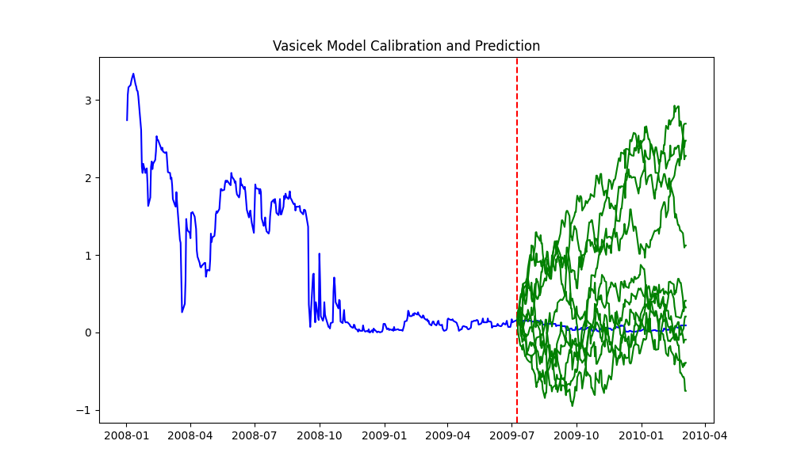
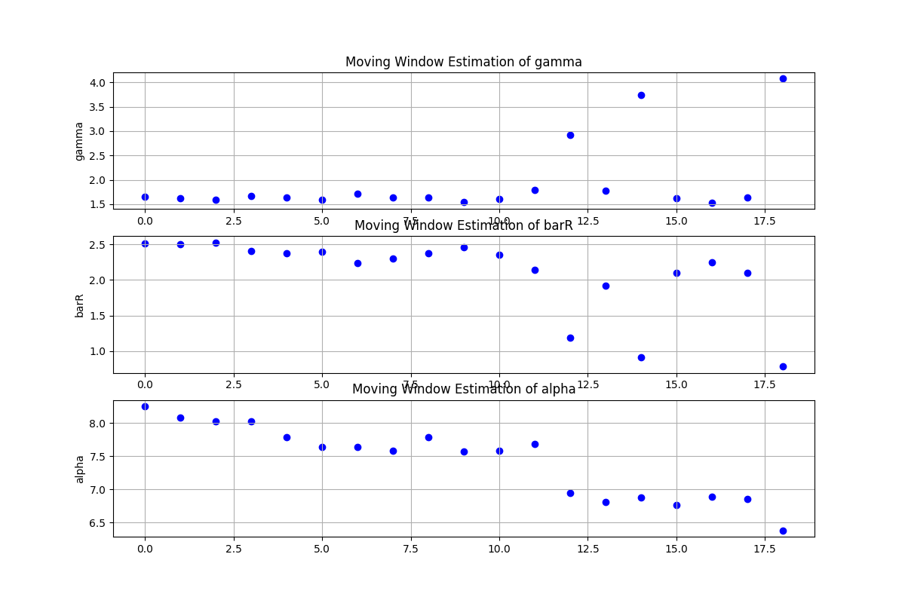

# Vasicek


## Sensitivity Analysis

### Parameter Recovery

We examine the robustness of the calibration results.

1. Simulate short rates and calibrate the model using MLE. 

The result shows that the sigma parameter is relatively stable, while the gamma and bar_r are sensitive to short rate changes.

2. Add noise to ZCB prices and calibrate the model using risk-neutral calibration.

The result shows that the sigma parameter is sensitive to noise, which indicates we should be cautious when using ZCB prices for calibration. We may consider calibrating volatility separately rather than using ZCB prices and risk-neutral calibration.

```plaintext
MLE Parameter Recovery Results:
Bias: [ 0.48054904 -0.01506855  0.00059596]
Standard Deviation: [0.94724384 0.14930257 0.02553081]
RMSE: [1.06216678 0.15006105 0.02553776]
RRMSE: [0.29180406 0.48768622 0.01408591]

Risk-Neutral Parameter Recovery Results:
Bias: [ 0.19455133 -0.06846515 -0.6786019 ]
RMSE: [0.59719612 0.07656089 0.9596563 ]
RRMSE: [0.16406487 0.24881669 0.52931952]
```

### Out-of-Sample Simulation 

We simulate short rates using the calibrated parameters and compare the simulated short rates with the actual short rates.

From the result, we can see the forecast performance is not very good, which indicates the Vasicek model may not be suitable for modeling short rates. This is consistent with the findings in the literature.




## Other

Also, we need about 100 days of data to get a relatively stable calibration result.


# Cox-Ingersoll-Ross (CIR) Model


## Sensitivity Analysis

### Parameter Recovery

We examine the robustness of the calibration results in MLE using parameter recovery. The result shows that the calibration is not stable.

Possible reasons include:

1. The parameters are not identifiable. Different parameter combinations can produce similar short rate dynamics.
2. The optimization algorithm may get stuck in local minima, leading to suboptimal parameter estimates.


```plaintext
True parameters: CIRparams(gamma=2.2, barR=0.05, alpha=0.1)
bias [0.45084599 0.01418719 0.01599974]
std [0.92480553 0.04271582 0.04835599]
rmse [1.0288476  0.04501019 0.05093421]
rrmse [0.467658   0.90020383 0.50934211]
```

### Moving Window Calibration
We perform a moving window calibration every 2 days to examine the stability of the calibration results over time.
The result shows that the calibration is not stable, which may be due to the same reasons mentioned above.


    
## Other

We need at least 500 days of data to get a relatively stable calibration result.


# Hull-White Model

## In-sample Fitting

I calibrated the Hull-White model based on caps prices. The in-sample fitting result shows that the model can fit the market prices well.

The RMSE and RRMSE between implied volatilities from market prices and model prices are very small, indicating a good fit.

```plaintext
Calibration success: True
Calibrated gamma: 0.09991703170133777
Calibrated sigma: 0.015449200199423408
RMSE: 0.00015747248434837467
RRMSE: 0.007237722105555996
```

The parameter $\theta(t)$ are used to fit the initial yield curve so they are not calibrated here. Instead, they are derived from the initial yield curve and the calibrated $\gamma$ and $\sigma$.

## Rebuilding the Yield Curve

I rebuilt the yield curve using the calibrated Hull-White model and compared it with the market yield curve. The result shows that the model can fit the market yield curve well.


